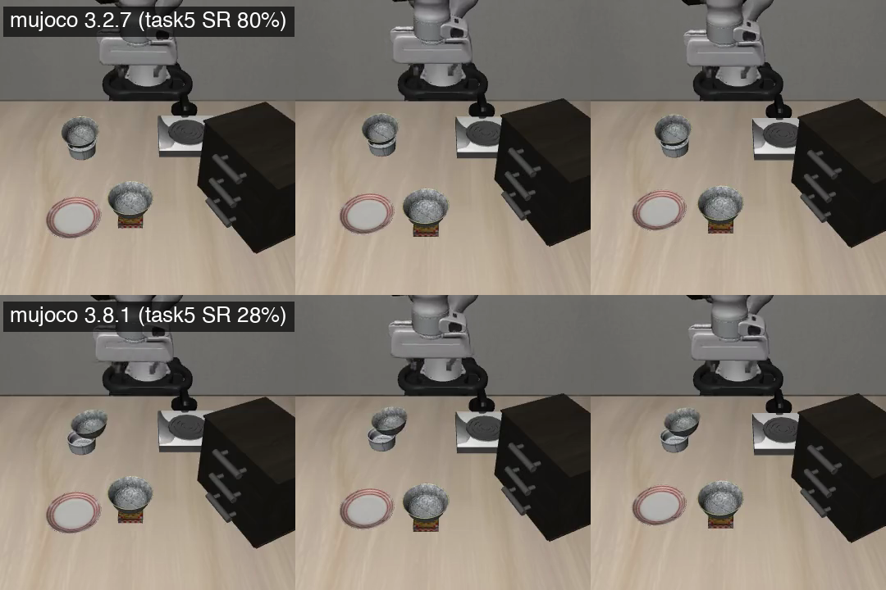

# VLA × LIBERO: Evaluation, Failure Attribution, and Upstream Findings

[中文版 / Chinese version](README.md)

A unified evaluation of three VLA models (SmolVLA 0.45B / π0.5 3.3B / OpenVLA-OFT 7.5B) on LIBERO-Spatial, with per-failure video attribution. Three upstream issues were found and reported along the way.

> **Scope**: This is an evaluation study plus a probe toolkit, not an evaluation framework. Each model runs on its own official stack (lerobot 0.6.0 / the OFT repo). What this repo adds is one fixed protocol, per-failure attribution, and probes that explain what the headline numbers hide.

## Results

| Model | Params | Inference config (official) | Success (n=500) | 95% CI | Published ref |
|---|---|---|---|---|---|
| OpenVLA-OFT (specialist) | 7.5B | action chunk 8, open-loop | **97.4** (487/500) | [95.6, 98.5] | 97.6 (paper) |
| OpenVLA-OFT (combined) | 7.5B | action chunk 8, open-loop | **97.4** (487/500) | [95.6, 98.5] | n/a |
| π0.5 | ~3.3B | chunk 50, execute 10 | **94.4** (472/500) | [92.0, 96.1] | 97.0 @ n=100 |
| SmolVLA (our finetune) | 0.45B | n_action_steps=1, re-plan every step | **87.4** (437/500) | [84.2, 90.0] | ~90 (paper) |

One protocol for all four rows: 10 tasks × 50 episodes, the exact same 500 benchmark-pinned initial layouts, MuJoCo 3.2.7 throughout, each model on its own published inference config. Per-task breakdown, checkpoints, and reconciliation with published numbers: **[results/leaderboard.md](results/leaderboard.md)**.

## Failure Mechanism Analysis

Failures were judged by watching the simulation videos (per-model coverage disclosed in the report):

| Failure family | SmolVLA 0.45B | π0.5 ~3.3B | OFT 7.5B |
|---|---|---|---|
| Contact geometry (grasp / transport / place) | all judged failures | low rate | low rate, but the main failure source |
| Referential confusion (goes for the wrong bowl) | none | **systematic** confusion | one isolated layout (1/500) |

Key observations:

- **Failure reproducibility is itself a diagnostic signal**: π0.5's stove ↔ cabinet confusion is a locked decision error; the same 10 task-7 layouts fail in two independently sampled runs (10/10 identical), and the model neatly places the *wrong* bowl on the plate. Failure-set overlap across re-runs separates "locked decision errors" from "millimeter contact luck."
- **Capacity lowers failure rates but does not eliminate mechanisms**: the off-center-grasp and double-bowl-grasp families show up at 0.45B and 7.5B alike; the systematic referential confusion was only observed in π0.5.

Full analysis in the leaderboard's "Failure mechanisms" section; annotated video ledgers in `results/failure_videos/`.

## Three Upstream Findings

### 1. A MuJoCo Bugfix Silently Rewrote the Benchmark

LIBERO task 5's init states store the black bowl suspended ~11 cm above a ramekin; the layout's real semantics are outsourced to the physics engine during a 10-step settling window inside `reset()`. MuJoCo 3.4.0 fixed box-box collision distances, changing the bowl's settled pose and silently rewriting the exam (pictured below):

- SmolVLA task 5: 80% → 28%
- OFT-family checkpoint: 98% → 12% (sister RL post-training project)
- π0.5: barely affected

A same-physics A/B (re-seated init, physics pinned) attributes the effect 100% to the broken init premise. The probe is policy-free, GPU-free, and takes seconds per version (`scripts/mj_settle_probe.py`).

**Reported upstream**: [lerobot#4390](https://github.com/huggingface/lerobot/issues/4390), [LIBERO#141](https://github.com/Lifelong-Robot-Learning/LIBERO/issues/141#issuecomment-5231993900), [RLinf#1460](https://github.com/RLinf/RLinf/issues/1460); standalone probe [gist](https://gist.github.com/Rick0525/6e6db2d1fe5f4358c980b569b123fde8)



### 2. A 46× Dataloader Slowdown

`datasets` ≥ 4.4 added a custom-format gate that silently turned lerobot's delta-timestamp queries into whole-row reads: ~100 PNGs decoded per sample to fetch 50×7 floats. A cached column-view fix brings 200.7 → 4.4 ms/sample (46×), cutting a 30k-step training run from 4h02m to ~1.9h.

**Reported upstream**: [lerobot#2895](https://github.com/huggingface/lerobot/issues/2895), acknowledged by the Hugging Face `datasets` maintainer; patch and tests in `patches/`

### 3. The Evaluation Loop Is Not Bit-Reproducible

Same weights, same config (md5-checked), same seeds: re-running each OFT checkpoint's full 500-episode suite still flips a few episode outcomes (specialist arm 7/500, combined arm 6/500; flips in both directions partially cancel into the net 3/500 and 2/500 quoted in Limitations). Step-level hashing of five quantities (sim state, proprio, both cameras, action) localized two independent non-determinism sources:

1. **EGL offscreen rendering**: the first divergence lands on camera images in 50/50 episodes, while the physics state is still bit-identical
2. **Cross-episode positional effects**: an episode's outcome depends on its position in the 500-episode sequence (MuJoCo warmstart cache and global RNG stream position; both causally verified by intervention)

Practical takeaway: any change to how the evaluation is executed (episode position in-sequence vs standalone, warmstart handling, RNG stream position, even upstream bugfixes) flips a different batch of edge layouts, so per-task LIBERO numbers inherently wobble by a few episodes. On task 7, the one task probed exhaustively, a cumulative 7/50 = 14% of layouts have flipped outcome under some perturbation.

**Full case file**: [results/oft_nondeterminism_case_zh.md](results/oft_nondeterminism_case_zh.md)

## SmolVLA Finetune

- **First attempt followed the lerobot docs' example command verbatim: 43%.** Diagnosed three compounding causes: `n_action_steps=50` costs ~35pp by itself (a purely evaluation-time parameter), batch 4 vs the paper's 64, and an LR schedule that floors at step 30k so the last 70% of a 100k run is near-idle.
- **Paper-aligned rerun**: global batch 64 (2×A800 DDP, bf16), 30k steps, 4h02m wall-clock (~1.9h after the dataloader fix) → **87.4% @ n=500**, vs the paper's ~90% @ n=100. The gap is not statistically significant (z=0.73, p=0.47).
- Full report: [results/smolvla_spatial_finetune_report.md](results/smolvla_spatial_finetune_report.md)

## Reproduce

```bash
pip install mujoco==3.2.7    # ≥3.4.0 silently breaks task 5's init premise (see finding 1)

# SmolVLA / π0.5: lerobot-eval (lerobot 0.6.0) with the main-table config
# OFT: official openvla-oft eval scripts, protocol unmodified

# Version-effect probe (no policy, no GPU, seconds per version)
python scripts/mj_settle_probe.py

# Pinned-layout retest
python scripts/attribution_probe.py --mode rollout --task-id 5 --init-index 3 \
    --model-path <ckpt> --n-action-steps <official value>
```

## Limitations

- LIBERO-Spatial only; Object / Goal / Long are out of scope.
- π0.5 is evaluated in action-only mode; the paper's hierarchical subtask reasoning is outside this evaluation.
- Headline numbers are single runs; re-run jitter is disclosed where measured (OFT full re-runs: 3/500 and 2/500 net).
- The SmolVLA row is our own finetune from the paper recipe, not an official checkpoint.

## Repo Layout

```
scripts/   Training & eval scripts + probes (settle, divergence, warmstart, RNG, action trace, etc.)
results/   Leaderboard (bilingual) · finetune report · attribution report · failure-video ledgers · nondeterminism case file
patches/   lerobot patches: 46× dataloader fix (#2895) · LIBERO env reuse (#3814)
```

Detailed evidence files are in Chinese (zh); the leaderboard and this README are bilingual.

## License

MIT
